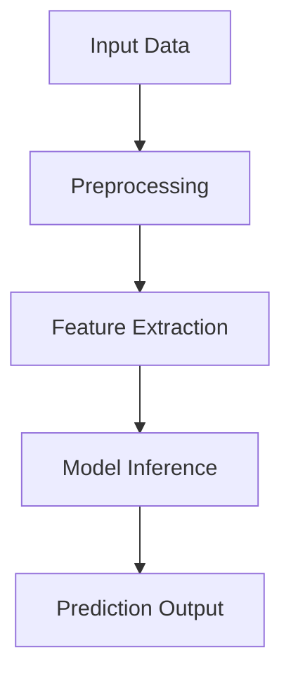

# Factify: AI News Classifier with Deep Learning

[](https://www.python.org/)
[](https://www.tensorflow.org/)
[](https://reactjs.org/)
[](https://tailwindcss.com/)
[](https://opensource.org/licenses/MIT)

The proliferation of fake news presents significant challenges to information integrity. The core problem of this project is to automatically distinguish between fake and real news articles based solely on their textual content. This system automatically classifies news articles as "real" or "fake" with 99% accuracy.

Modern social media platforms and online news outlets enable the rapid dissemination of information, but they also facilitate the widespread propagation of intentionally false or misleading content—commonly known as fake news. This phenomenon undermines public trust, distorts democratic processes, and can lead to tangible harms such as public health scares or financial market disruptions.


---

### Key Features
- **98.5% Accuracy** with LSTM-GRU architecture
- **Modern React Frontend** with Glassmorphism UI
- **End-to-end CI/CD pipeline** with GitHub Actions
- **Dockerized Deployment** ready for cloud hosting
- **FastAPI Backend** for high-performance inference

---

### Technical Stack
| Component          | Technology |
|--------------------|------------|
| **Backend**        | Python 3.9, FastAPI, Uvicorn |
| **ML Framework**   | TensorFlow 2.8, Keras |
| **Data Processing**| Pandas, NLTK, Scikit-learn |
| **Frontend**       | React (Vite), Tailwind CSS, DaisyUI |
| **Container**      | Docker |
| **CI/CD**          | GitHub Actions |

---

## Project Structure

```text
Factify/
├── .github/                     # GitHub Actions (CI/CD)
│   └── workflows/
│       └── ci.yml               # Pipeline: Run Pytest (Backend) & Build (Frontend)
├── app/                         # FastAPI Backend Core
│   ├── api/
│   │   ├── __init__.py
│   │   └── endpoints.py         # API Router: Handles /predict and /health endpoints
│   ├── core/
│   │   ├── __init__.py
│   │   ├── config.py            # Configuration: Env variables, App Settings
│   │   └── logger.py            # Logging: Custom Loguru/logging setup
│   ├── models/
│   │   ├── __init__.py
│   │   └── schemas.py           # Pydantic Models: Request/Response Validation
│   ├── services/
│   │   ├── __init__.py
│   │   ├── data_loader.py       # Data: Logic to load CSVs (Training only)
│   │   ├── model.py             # Model: Keras LSTM/GRU Architecture Definition
│   │   ├── prediction.py        # Inference: Singleton Class for Predictions
│   │   └── preprocessing.py     # NLP: Text Cleaning, Tokenization, Padding
│   ├── utils/
│   │   └── __init__.py
│   ├── __init__.py
│   └── main.py                  # Entry Point: FastAPI App Initialization & Middleware
├── data/                        # Datasets (Training)
│   ├── processed/               # Cleaned Data (if generated)
│   └── raw/
│       ├── Fake.csv             # Raw Fake News Dataset
│       └── True.csv             # Raw Real News Dataset
├── frontend/                    # React Frontend (Vite)
│   ├── public/                  # Static Assets
│   │   └── vite.svg
│   ├── src/
│   │   ├── assets/              # Component Assets
│   │   │   └── react.svg
│   │   ├── components/          # Reusable Components
│   │   │   ├── features/
│   │   │   │   └── PredictionForm.jsx  # Main Form Component (Logic + UI)
│   │   │   └── layout/
│   │   │       ├── Footer.jsx          # Application Footer
│   │   │       └── Header.jsx          # Application Header
│   │   ├── pages/               # Route Pages
│   │   │   └── Home.jsx         # Landing Page (Orchestrates Components)
│   │   ├── services/            # API Layer
│   │   │   └── api.js           # Axios Setup & API Calls
│   │   ├── App.css
│   │   ├── App.jsx              # Main React Component
│   │   ├── index.css            # Tailwind Imports & Global Styles
│   │   └── main.jsx             # React DOM Entry
│   ├── .gitignore
│   ├── eslint.config.js         # Linter Config
│   ├── index.html               # Frontend Entry Point
│   ├── package-lock.json
│   ├── package.json             # Frontend Dependencies & Scripts
│   ├── postcss.config.js        # PostCSS Configuration
│   ├── tailwind.config.js       # Tailwind CSS Configuration
│   └── vite.config.js           # Vite Builder Configuration
├── logs/                        # Application Logs
│   └── app.log                  # Runtime Log File
├── models/                      # Trained Model Artifacts
│   ├── saved_models/
│   │   ├── fake_news_detector.h5  # Trained Keras Model File
│   │   └── tokenizer.pickle       # Saved Tokenizer Object
│   └── best_model_checkpoint.h5
├── notebooks/                   # Experiments
│   └── experiment.ipynb         # Jupyter Notebook for Model Training/Analysis
├── tests/                       # Test Suite (Backend)
│   ├── conftest.py              # Pytest Fixtures
│   ├── test_api.py              # API Integration Tests
│   ├── test_app.py              # App Startup/Shutdown Tests
│   ├── test_logger.py           # Logging Logic Tests
│   └── test_services.py         # Business Logic/ML Tests
├── .gitattributes
├── .gitignore                   # Root Git Ignore
├── DEPLOYMENT.md                # Deployment Guide (Hugging Face / Vercel)
├── Dockerfile                   # Docker Configuration for Backend
├── LICENSE                      # Project License
├── pyproject.toml               # Python Project Config
├── pytest.ini                   # Pytest Settings
├── requirements.txt             # Python Dependencies
├── run.py                       # Helper Script to Run Backend Locally
├── setup.py                     # Python Package Setup
└── README.md                    # Project Documentation
```

---

### **Model Architecture**
**LSTM-GRU Hybrid (Best Performing Model)**
```python
Sequential([
    Embedding(10000, 100),
    LSTM(100, return_sequences=True),
    GRU(100),
    Dropout(0.2),
    Dense(1, activation='sigmoid')
])
```
---

## System Architecture <a name="system-architecture"></a>


---

### Components
1. **Data Ingestion Layer**
   - CSV/JSON file support
   - Database connectors

2. **Processing Layer**
   - Text normalization
   - Tokenization
   - Sequence padding

3. **Model Layer**
   - Ensemble of 7 LSTM variants
   - Model versioning

---

##  Data Pipeline <a name="data-pipeline"></a>
### Data Sources
- Kaggle dataset (True/Fake News)
- 42,000 labeled articles (balanced)

### Preprocessing Steps
1. **Cleaning**:
   - URL removal
   - HTML tag stripping
   - Special character removal

2. **Normalization**:
   - Case folding
   - Stopword removal
   - Stemming

3. **Feature Engineering**:
   - Word counts
   - Sentence counts
   - Character counts

---

##  Model Specifications <a name="model-specifications"></a>
### Model Comparison
| Model Type               | Accuracy | Precision | Recall |
|--------------------------|----------|-----------|--------|
| LSTM with GRU            | 0.99     | 0.99      | 0.99   |
| Bidirectional LSTM       | 0.99     | 0.99      | 0.99   |
| CNN-LSTM Hybrid          | 0.99     | 0.99      | 0.99   |

---

## Performance Metrics <a name="performance-metrics"></a>
### Evaluation Results
```python
              precision    recall  f1-score   support

           0       0.99      0.99      0.99      4689
           1       0.99      0.99      0.99      4287

    accuracy                           0.99      8976
   macro avg       0.99      0.99      0.99      8976
weighted avg       0.99      0.99      0.99      8976
```

---

## Installation & Setup

### Prerequisites
- Python 3.9+
- Node.js 18+

### 1. Clone the Repository
```bash
git clone https://github.com/Md-Emon-Hasan/Factify.git
cd Factify
```

### 2. Backend Setup
```bash
# Create Virtual Environment
python -m venv venv
# Activate (Windows)
venv\Scripts\activate
# Activate (Linux/Mac)
source venv/bin/activate

# Install Dependencies
pip install -r requirements.txt
```

### 3. Frontend Setup
```bash
cd frontend
# Install Dependencies
npm install
```

---

## Usage

### Running Locally

**Terminal 1: Backend**
```bash
# From root directory
python run.py
# Backend runs at http://localhost:8000
```

**Terminal 2: Frontend**
```bash
# From frontend directory
cd frontend
npm run dev
# Frontend runs at http://localhost:5173
```

### Running Tests
**Backend Tests:**
```bash
pytest --cov=app tests/
```

**Frontend Build Check:**
```bash
cd frontend
npm run build
```

### Docker
Build and run the backend container:
```bash
docker build -t factify .
docker run -p 7860:7860 factify
```

---

## **Developed By**

**Md Emon Hasan**  
**Email:** emon.mlengineer@gmail.com
**WhatsApp:** [+8801834363533](https://wa.me/8801834363533)  
**GitHub:** [Md-Emon-Hasan](https://github.com/Md-Emon-Hasan)  
**LinkedIn:** [Md Emon Hasan](https://www.linkedin.com/in/md-emon-hasan-695483237/)  
**Facebook:** [Md Emon Hasan](https://www.facebook.com/mdemon.hasan2001/)

---