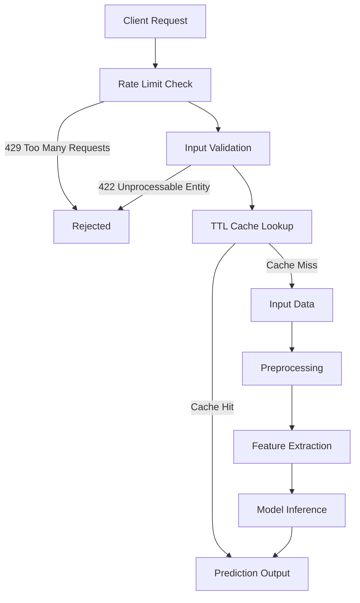

# Factify: AI News Classifier with Deep Learning

[](https://www.python.org/)
[](https://www.tensorflow.org/)
[](https://reactjs.org/)
[](https://tailwindcss.com/)
[](https://opensource.org/licenses/MIT)

The proliferation of fake news presents significant challenges to information integrity. The core problem of this project is to automatically distinguish between fake and real news articles based solely on their textual content. This system automatically classifies news articles as "real" or "fake" with 99% accuracy.

Modern social media platforms and online news outlets enable the rapid dissemination of information, but they also facilitate the widespread propagation of intentionally false or misleading content—commonly known as fake news. This phenomenon undermines public trust, distorts democratic processes, and can lead to tangible harms such as public health scares or financial market disruptions.

[](https://github.com/user-attachments/assets/24904cfe-8c32-4a65-aa4d-48bc18e45e5e)


<!--  -->

<!--  -->

---

### Key Features
- **99% Accuracy** with LSTM-GRU architecture
- **Modern React Frontend** with Glassmorphism UI
- **End-to-end CI/CD pipeline** with GitHub Actions
- **Dockerized Deployment** ready for cloud hosting
- **FastAPI Backend** for high-performance inference
- **In-Memory Response Caching** (thread-safe TTL cache) so repeat articles skip inference entirely
- **Rate Limiting** on the prediction endpoint, proxy-aware so each real client gets its own bucket
- **Model Warm-up on Startup** so the first user never pays TensorFlow's graph-tracing cost
- **Input Validation** that rejects too-short, oversized, or non-textual submissions with a readable 422

---

### Technical Stack
| Component          | Technology |
|--------------------|------------|
| **Backend**        | Python 3.9, FastAPI, Uvicorn |
| **ML Framework**   | TensorFlow 2.8, Keras |
| **Data Processing**| Pandas, NLTK, Scikit-learn |
| **Frontend**       | React (Vite), Tailwind CSS, DaisyUI |
| **Container**      | Docker |
| **CI/CD**          | GitHub Actions |
| **Caching**        | cachetools TTLCache (thread-safe in-memory) |
| **Rate Limiting**  | slowapi (proxy-aware keying) |

---

## Project Structure

```text
Factify/
├── .github/                     # GitHub Actions
│   └── workflows/
│       ├── ci-cd.yml            # Docker Build & Test Pipeline
│       └── ci.yml               # Standard CI Pipeline
├── backend/                     # Backend Source Code
│   ├── app/                     # FastAPI Application
│   │   ├── api/                 # API Endpoints
│   │   │   ├── __init__.py
│   │   │   └── endpoints.py     # API Router
│   │   ├── core/                # Config & Logging
│   │   │   ├── __init__.py
│   │   │   ├── cache.py         # Thread-Safe TTL Cache
│   │   │   ├── config.py        # Settings & Env Vars
│   │   │   ├── limiter.py       # Rate Limiter & Client IP
│   │   │   └── logger.py        # Custom Logging
│   │   ├── models/              # Pydantic Schemas
│   │   │   ├── __init__.py
│   │   │   └── schemas.py       # Request/Response Models
│   │   ├── services/            # Business Logic & ML
│   │   │   ├── __init__.py
│   │   │   ├── data_loader.py   # Data Loading Logic
│   │   │   ├── model.py         # Keras Model Definition
│   │   │   ├── prediction.py    # Inference Singleton
│   │   │   └── preprocessing.py # NLP Text Processing
│   │   ├── utils/
│   │   │   └── __init__.py
│   │   ├── __init__.py
│   │   └── main.py              # Backend Entry Point
│   ├── data/                    # Datasets
│   │   ├── processed/           # Cleaned Data
│   │   └── raw/
│   │       ├── Fake.csv
│   │       └── True.csv
│   ├── logs/                    # Application Logs
│   │   └── app.log
│   ├── models/                  # ML Artifacts
│   │   ├── saved_models/
│   │   │   ├── fake_news_detector.h5
│   │   │   └── tokenizer.pickle
│   │   └── best_model_checkpoint.h5
│   ├── notebooks/               # Experiments
│   │   └── experiment.ipynb
│   ├── tests/                   # Backend Test Suite
│   │   ├── conftest.py
│   │   ├── test_api.py
│   │   ├── test_app.py
│   │   ├── test_cache.py
│   │   ├── test_logger.py
│   │   ├── test_rate_limit.py
│   │   ├── test_services.py
│   │   ├── test_validation.py
│   │   └── test_warmup.py
│   ├── Dockerfile               # Backend Dockerfile
│   ├── pyproject.toml           # Python Project Config
│   ├── pytest.ini               # Pytest Config
│   ├── requirements.txt         # Backend Dependencies
│   └── setup.py                 # Package Setup
├── docs/                        # Documentation
│   └── img/
├── frontend/                    # Frontend Source Code
│   ├── public/                  # Static Assets
│   │   └── vite.svg
│   ├── src/                     # React Source
│   │   ├── assets/
│   │   │   └── react.svg
│   │   ├── components/
│   │   │   ├── features/
│   │   │   │   └── PredictionForm.jsx
│   │   │   └── layout/
│   │   │       ├── Footer.jsx
│   │   │       └── Header.jsx
│   │   ├── pages/
│   │   │   └── Home.jsx
│   │   ├── services/
│   │   │   └── api.js
│   │   ├── App.css
│   │   ├── App.jsx
│   │   ├── index.css
│   │   └── main.jsx
│   ├── .gitignore
│   ├── Dockerfile               # Frontend Dockerfile
│   ├── eslint.config.js         # Linter Config
│   ├── index.html               # Entry HTML
│   ├── package-lock.json
│   ├── package.json             
│   ├── postcss.config.js
│   ├── tailwind.config.js
│   └── vite.config.js
├── .gitattributes
├── .gitignore
├── demo.png                     # App Screenshot
├── demo.mp4                     # App Video
├── docker-compose.yml           # Docker Orchestration
├── LICENSE
├── README.md
├── render.yml                
└── run.py                       # Application Start Script
```

---

### **Model Architecture**
**LSTM-GRU Hybrid (Best Performing Model)**
```python
Sequential([
    Embedding(10000, 100),
    LSTM(100, return_sequences=True),
    GRU(100),
    Dropout(0.2),
    Dense(1, activation='sigmoid')
])
```
---

## System Architecture <a name="system-architecture"></a>


---

### Components
1. **Data Ingestion Layer**
   - CSV/JSON file support
   - Database connectors

2. **Processing Layer**
   - Text normalization
   - Tokenization
   - Sequence padding

3. **Model Layer**
   - Ensemble of 7 LSTM variants
   - Model versioning

---

##  Data Pipeline <a name="data-pipeline"></a>
### Data Sources
- Kaggle dataset (True/Fake News)
- 42,000 labeled articles (balanced)

### Preprocessing Steps
1. **Cleaning**:
   - URL removal
   - HTML tag stripping
   - Special character removal

2. **Normalization**:
   - Case folding
   - Stopword removal
   - Stemming

3. **Feature Engineering**:
   - Word counts
   - Sentence counts
   - Character counts

---

##  Model Specifications <a name="model-specifications"></a>
### Model Comparison
| Model Type               | Accuracy | Precision | Recall |
|--------------------------|----------|-----------|--------|
| LSTM with GRU            | 0.99     | 0.99      | 0.99   |
| Bidirectional LSTM       | 0.99     | 0.99      | 0.99   |
| CNN-LSTM Hybrid          | 0.99     | 0.99      | 0.99   |

---

## Performance Metrics <a name="performance-metrics"></a>
### Evaluation Results
```python
              precision    recall  f1-score   support

           0       0.99      0.99      0.99      4689
           1       0.99      0.99      0.99      4287

    accuracy                           0.99      8976
   macro avg       0.99      0.99      0.99      8976
weighted avg       0.99      0.99      0.99      8976
```

---

## Installation & Setup

### Prerequisites
- Python 3.9+
- Node.js 18+
- Docker (Optional)

### 1. Clone the Repository
```bash
git clone https://github.com/Md-Emon-Hasan/Factify.git
cd Factify
```

### 2. Manual Setup (Without Docker)

**Backend:**
```bash
cd backend
python -m venv venv
# Activate: venv\Scripts\activate (Win) or source venv/bin/activate (Linux/Mac)
pip install -r requirements.txt
```

**Frontend:**
```bash
cd frontend
npm install
```

---

## Usage

### Option 1: Universal Start Script (Recommended)
Run the entire project (Frontend + Backend) with a single command from the **root** directory:
```bash
python run.py
```
- **Backend**: http://localhost:8000
- **Frontend**: http://localhost:5173
- Press `Ctrl+C` to stop both services.

### Option 2: Docker Compose
Run the full stack in containers:
```bash
docker-compose up --build
```
- **Backend**: http://localhost:7860
- **Frontend**: http://localhost:80

### Option 3: Running Services Individually

**Backend Only:**
```bash
cd backend
uvicorn app.main:app --host 0.0.0.0 --port 8000 --reload
```

**Frontend Only:**
```bash
cd frontend
npm run dev
```

---

## API Endpoints

| Method | Path              | Description                                                        | Rate Limit  | Cache TTL |
|--------|-------------------|--------------------------------------------------------------------|-------------|-----------|
| GET    | `/`               | Root banner confirming the API is up                                | Unlimited   | None      |
| GET    | `/health`         | Health check used by Docker/Render probes                           | Unlimited   | None      |
| POST   | `/predict`        | Classify an article as `REAL` or `FAKE` with a confidence score     | 20/minute   | 3600s     |
| GET    | `/api/model-info` | Static model metadata (architecture, accuracy, vocab, loaded state) | Unlimited   | None      |

Interactive OpenAPI docs remain available at `/docs`.

---

## Testing & linting

### Backend
Run from the `backend/` directory:
```bash
cd backend
# Run Tests
pytest
# Run Linter
flake8 .
```

### Frontend
Run from the `frontend/` directory:
```bash
cd frontend
# Run Linter
npm run lint
```

---

## CI/CD Pipeline
The project uses GitHub Actions for automated testing and deployment checks:
- **CI Pipeline**: Runs on every push/PR to `main`. It installs dependencies, runs `flake8` linting, and executes `pytest` for the backend.
- **Docker Build**: Verifies that the Docker image builds successfully.

---

## **Developed By**

**Md Emon Hasan**  
**Email:** emon.mlengineer@gmail.com
**WhatsApp:** [+8801834363533](https://wa.me/8801834363533)  
**GitHub:** [Md-Emon-Hasan](https://github.com/Md-Emon-Hasan)  
**LinkedIn:** [Md Emon Hasan](https://www.linkedin.com/in/md-emon-hasan-695483237/)  
**Facebook:** [Md Emon Hasan](https://www.facebook.com/mdemon.hasan2001/)

---